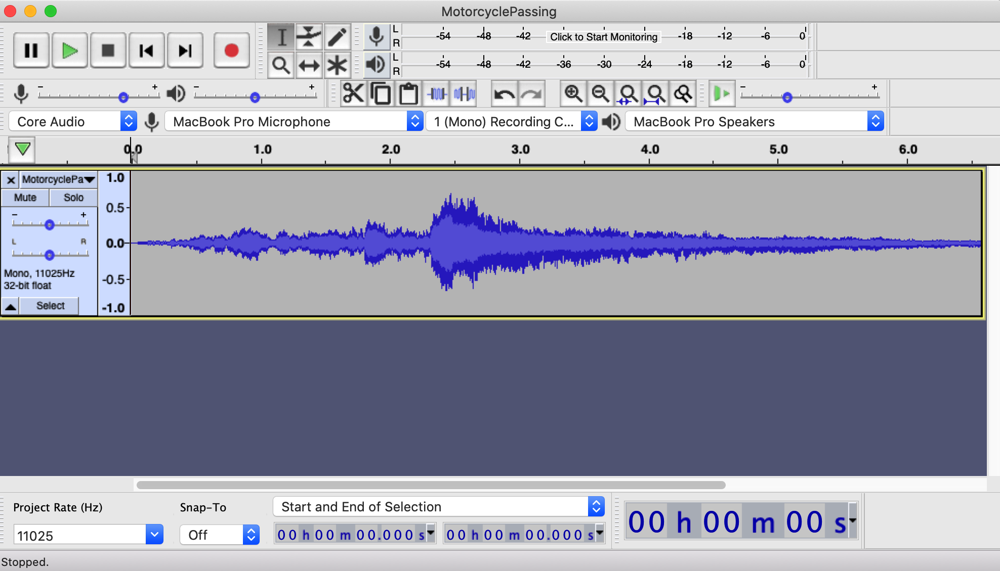
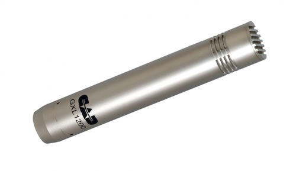
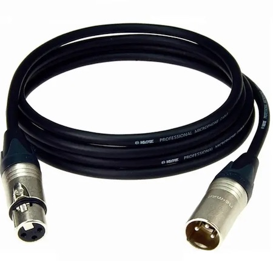
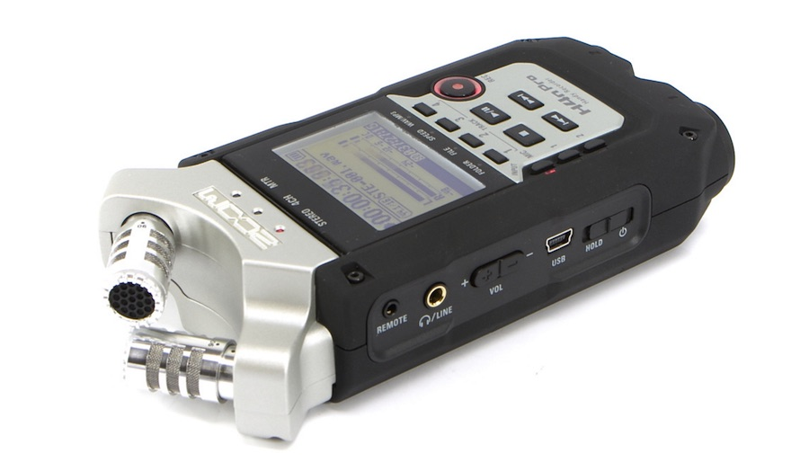
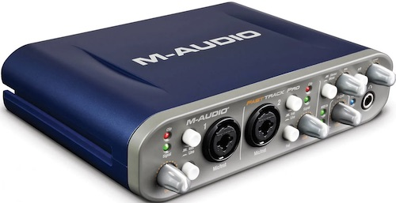

# Digital Audio Workstation (DAW) Basics

## Audio Editing Software

In this course we are going to centre our discussion on a tool called **Audacity**, which is a robust, venerable, open-source audio editor. It's been around for years, does all the important things, and it's kind of ugly. If you need something different, you are encouraged to branch out to prettier, fancier, less open-source tools like GarageBand, Adobe Audition, Logic, Hindenburg, and so on. 

Despite differences in user interface design and fine details of functionality, all of these tools work more or less the same way.

The fundamental metaphor is a *magical tape recorder*. Like a tape recorder, the basic unit is the **track** -- that is, recording one audio source alongside others -- and in DAW software you can both *hear* and *see* it, via a depiction of the actual waveform.

You can have multiple tracks, either recorded simultaneously or layered one at a time. If you were recording music, you would almost certainly record multiple tracks; for an audiobook with a single narrator, you might need only one or two.

The software has "tape-deck" controls like Play, Pause, Record, Rewind. You can also move around in a track by positioning the "play head" (usually a vertical line) in the waveform by using your mouse or trackpad.

The magic of digital media comes when, in a track, you can *select*, *cut*, *copy*, and *paste* just like in any other software. This makes editing, trimming, and remixing audio a little bit like editing text.

Further, for each track, you have control over recording level, volume relative to other tracks, "panning" (left or right in stereo), and lots of digital effects that you can add to colour your sound.

Please also see the [Guide to Using Audacity for Beginners](Audacity.md) written by MPubbers Dara Sheere and Lauren McKenney in PUB 607 last year!

## How to Record: A basic method

There are many different ways to do this, but here's one to start with. For your reference, we also wrote a more detailed how-to for [getting started with the Zoom recorder](ZoomRecording.md). The little user manual for the Zoom is also very good.

1. Plug headphones into the Zoom recorder so you can "monitor" what you're recording. **This is important** -- if you can hear what you're recording while you are recording it, it will save you hours of lost time.

2. Find a **quiet** room. You need to listen to your recording environment with headphones on; that will make the ambient noise much more apparent.

3. Plug an SM58 mic into the Zoom recorder using an XLR cable and select the external mic setting on the Zoom.

4. Say "test, 1, 2, 3" over and over again while fiddling with the "rec level" controls on the Zoom to ensure that you are getting a strong signal that does not "clip" or overload, especially on the letter "P". Pay attention to how close you are to the microphone!

5. Start recording and say your piece. End the recording and save it with a filename you'll remember in step 7 below. Listen to the playback. Does it sound alright? If not, go back to Step 2.

6. Plug the Zoom recorder into your laptop with a USB cable. Plug your headphones into your laptop too.

7. Load the recoding onto your computer. Open up Audacity. Import the recording into Audacity. Play it back. 

8. If you're happy with the basic recording, begin by "trimming" the silence (or unwanted fumbling sounds) from the beginning and end of the recording. If you're ambitious, you can also edit out unwanted pauses.

9. Stay up late into the night playing with digital effects. Listen carefully for Satanic messages hidden in the audio when you play it backwards (sorry, an Eighties reference; alternatively, listen for "Paul is dead" -- a Sixties reference).

10. Decide that minimal effects (or none at all) is probably the best option. Hopefully you have not stayed up all night before coming to this conclusion.

11. Export the recording as an MP3, and post it on your Github repo.

There are many variations on this process. You can also record direct to your computer by using the Zoom as an "audio interface"[^1] instead of a recorder. You can also try different microphones, different spaces, and different microphone placement.*

## Some Gear We Have On Hand

- [Shure SM58](#shure-sm58) dynamic mics (courtesy of the FCAT Dean's office)

- [CAD GXL1200](#cad-gxl1200) condenser mic  (John's)

- [XLR Cables](#xlr-cables) to connect microphones (from the Dean's office + 1 from John)

- [USB Cables](#usb-cables) – USB "Mini" cables to connect Zoom H4n Pros to computer; also a USB "B" cable to connect the FastTrack Pro interface

- [Zoom H4n Pro](#zoom-h4n-pro) portable recorders (courtesy of the FCAT Dean's office)

- [M-Audio FastTrack Pro](#m-audio-fasttrack-pro) USB Audio Interface (John's)

See below for details on these bits.

## Gear also available (to some of you at least)

- the microphone in your laptop (surpisingly good, actually)

- the microphone in your phone

- headphones, which are better than earbuds, which are better than listening through small speakers

- John has a mic stand he can bring in.
 

## About "Dynamic" vs "Condenser" Microphones

A **dynamic mic** like the Shure SM58 is a supremely simple, low-tech thing. It actually uses no electricity -- because it *generates* electricity: the sound waves from your voice wiggle a little "diaphragm" which moves a coil of wire past a magnet -- and voila, an electric signal.  Dynamic mics are simple, robust, long-lasting (see "mic drop" but **do not** actually do this). But they require a close, direct sound source -- someone speaking directly into the microphone, or a drum, or an amplifier.

A **condenser mic** works differently: a small electric current flows through the mic, and the sound waves from your voice wiggle the "condenser," which affects the electric signal. Condenser mics are more sensitive at a distance, and therefore better for capturing audio from a farther and/or larger source (like a piano, or a choir) and more ambient sound from the room. You do not "eat" these mics... probably more like 20–60cm away.

The Zoom recorders have a *pair* of condenser mics on the top of them (for stereo recording). Your laptop also has a tiny condenser mic in it.

Because a condenser mic needs electricity, there has to be a source. Both the Zoom recorder and John's FastTrack Pro Audio Interface have the ability to provide "Phantom power" -- which is a low-current, 48volt source that allows a condenser mic to work. Or if you're using a built-in mic, don't worry about it, because it's already wired up.

## Some specifics on the gear...

### Shure SM58

The **SM58** is the classic "ice cream cone" style mic, as used by Aretha Franklin and a few zillion other artists over the years :-) The '58 is the gold standard for a "dynamic microphone." They started making these in *1966* and they are still the standard. That's good technology!

A dynamic mic like this works by being quite close to the sound source (see "eat the mic" but don't actually do that; a couple inches away is better). Close miking results in that warm, intimate sound, like in *Witch, Please!*; also, Aretha Franklin belting out *Respect*. A dynamic mic also helps minimize ambient or background sounds because it is all about what's *right in front of it.* 

It occurs to me that an SM58, being a very up-close-and-personal microphone, is probably a terrific **germ vector**. Best option would be for these mics to be used by one person only. But you can clean them pretty easily -- you can simply unscrew the ball-shaped cage and wash it. Here's the manufacturer's instructions: <https://service.shure.com/s/article/how-should-i-clean-my-microphone?language=en_US>

### CAD GXL1200

John brought this one in. You can use it just like you do the Shure SM58, and see if you like the results. It's quite a bit more sensitive than an SM58, so it needs to be placed farther away if you're recording your voice -- a good trick is to mount it on a stand and point it at your forehead instead of your mouth, to avoid "Popping your Ps." (look that up!)

A condenser mic like this requires 48volts of "Phantom power" -- which is available on both the Zoom recorder and the FastTrack Pro Audio Interface... you just switch that on and it works. This mic probably also will benefit from a stand of some sort.

### XLR Cables

These are OLD tech, from the 1950s, but they work really well. They are big, heavy, well-insulated three-wire cables with a big chunky three-pin connector. These have been the standard connection for microphones (and various other professional audio things) for 60+ years. 

What they do really well is provide a "balanced" electrical signal that is very impervious to interference (that is, noise) even over very long cables (up to 200 ft). They are also really tough and durable.

### USB Cables

Unfortunately, the so-called "Universal" Serial Bus isn't *quite* standardized. There are a lot of different connectors, which keeps the cable vendors profitable forever.

A-type is the usual flat ones you see everywhere. C-type are the ones on your new laptop, and your Android phone. "Mini" is common on cameras and audio devices (like the Zoom recorder) because it's pretty robust when it's likely to get knocked around. B-type is a less common plug for cameras and audio devices. And then there's that iPhone plug that's different again. *Adapters! Where are my adapters???*

### Zoom H4n Pro 

The **Zoom H4n Pro** recorders are Hannah McGregor's favourite tool. They are a nice small handheld device with a LOT of flexibility. You can optionally plug up to two external mics into each one, but they have their own pair of stereo condenser mics built right in.

The Zoom recorders record onto an SD Card which can record hours of audio.

They run on two AA batteries, so you can take them to the beach and capture the sounds of seagulls -- and then dump the recording back to your computer by connecting one of the USB Cables.

Alternatively, you can also use the H4n Pro as a direct, live **USB Audio Interface** between the microphone and your laptop -- if you're indoors, this might be better, because then you can use your computer screen instead of the tiny interface on the recorder.

### M-Audio FastTrack Pro 

John brought in this old (2012-ish?) USB Audio Interface. 

This does PART of what the Zoom H4n does -- it takes **XLR Cables** or regular old 1/4" audio cords and converts the incoming analogue signal into digital signals which then go via USB to your computer. This is the fundamental device that makes digital audio recording possible. In professional studios, they have very big fancy ones; this is a very simple, cheap one. It has two inputs. The Zoom recorder can also be used as a direct Audio Interface like this as well as being a standalone recorder.

[^1]: If you are going to record directly to your laptop, using an dedicated USB **Audio Interface** or set up the Zoom recorder as an Audio Interface, there is a step you definitely need to take first: Quit your web browser. Better still, restart your laptop and don't open your web browser. Your laptop works hard. You should probably give it some thanks. Seriously, it's doing all sorts of things in the background so that you don't have to think about them. One of those things is managing the audio system. When you're running your browser (through which things like Zoom and Teams and YouTube happen), your browser grabs hold of tons of resources for audio, which ensures that Teams and Zoom and YouTube operate properly. 

      But if you then start up Audacity or another DAW, you might find that your laptop can't give it the resources that it needs, because Chrome (or whatever) has already claimed them. So, to get a decent recording environment, you need to **shut down the Web browser first.** Or, as I suggest, restart the computer, and don't start up any software except for the DAW... then it will work nicely.

