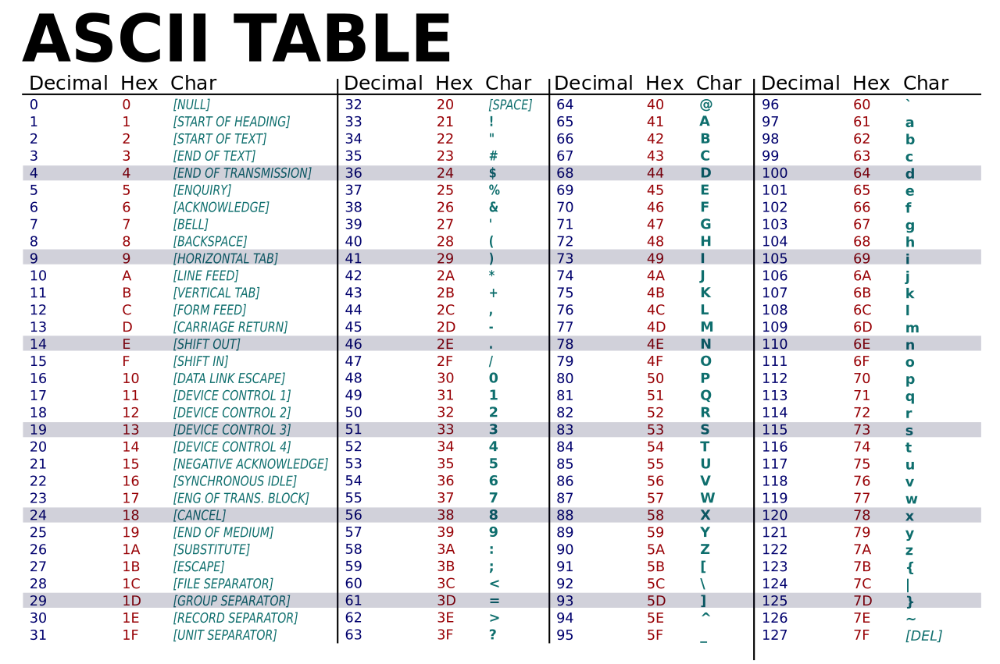

# Digital Text Production

## Alphabets, ASCII, and Unicode

"In the beginning was the *Word*"

- ...but it's all just ones and zeros, right?

A 'Word' = a Byte. 8 bits. 

How do we make bytes into something useful, like text? It's just a convention. A general agreement that this particular number -- represented as a byte, which, in 8-bits, is a number between 0 and 255, between 0 and 1111111, or (more conveniently, in hex) between 0 and FF -- stands for a particular letter of the alphabet.

Capital 'A' is ASCII code 65 -- or 41 in hex (right?) -- 'B' is 66, and so on.

ASCII -- the "American Standard Code for Information Interchange" was an enormously successful standard -- still with us today, after 60 years (1963). 

How many letters in the English alphabet? 26  
x2 for upper and lowercase - 52  
+ ten digits - 62  
+ 30 punctuation marks - 92  
+ 30-odd control codes for early systems - 127  
+ the last binary bit reserved for error control - 255  

So ASCII is an alphabet with 127 possible characters. Sounds great, what could possibly go wrong?

To get around the anglocentrism of that, a variety NON-standard schemes emerged. "Eight-bit extended character sets." Apple had one, Microsoft had a different one. IBM had another. Various standards were proposed (e.g., ISO 8859) but not uniformly adopted.

But a mess, generally. And non-Europeans (e.g. China) were still utterly left out.

## Unicode 

A solution came forward circa 1997, in the Unicode standard, which could encode a possible 1,112,064 possible characters

The simplest Unicode implementation, UTF-8, made for an easy replacement for ASCII. Based on fixed 8-bit chunks (up to 4, for a million characters), and "a UTF-8 file that contains only ASCII characters is identical to an ASCII file."

But implementations are still complex. This is literally like changing the alphabet from under us.

Unicode is supported by pretty much everything now. Mac OS X, Windows, Unix and Unix-derived operating systems. XML, HTML, and the Web and Internet standards.

BUT LEGACY SYSTEMS ARE STILL WITH US.. old software (esp critical databases) sometimes don't, and so stuff messes up.

If you see little rectangles, or these things -- �  ⸻ -- something in your toolchain has failed to support your Unicode.

Unicode support means is that you can type accented characters, and curly quotes, and em-dashes, and greek, and whatever WITHOUT WORRYING about it. Until recently, this was not so simple.

You used to have to write  U+2014 or `&#x2014;` or `&mdash;` but with Unicode, you can just type an em-dash. On the Mac, shift-option-hyphen.

And, of course, you can also write in Arabic or Bengali, or whatever.

Important piece of trivia about Unicode:

A "code-point" is not a **glyph**. A code-point is an abstract representation of a character in the system. A glyph is an actual mark. So, individual glyphs -- for instance, **ligatures** -- are variable, and are actually defined in individual fonts. 

In all the fonts in the world, there are only a tiny handful that represent all of the Unicode space.

Pay attention to what Unicode support your typefaces include. Old fonts are sometimes terrible.

Interlude on Indigenous typography.

## Line breaks

Once we have an alphabet we can all (!) agree on, we can put text in files.

The original, most basic structural element in text files is the **line break**. Also known as "carriage return". Unfortunately, in ASCII (and Unicode), there are two of them: line feed (LF, from teletype) and carriage return (CR, from typewriters) are represented. And if there are two ways to do things, people will do both. Or either. And so, historically, some systems used LF, some CR, and some, unfortunately (Microsoft we are looking at you), BOTH. It's not a huge hassle, but something to be aware of.

The old Unix standard for text files had line breaks (LF) making lines about 80 characters long. Early text editor software edited one line at a time. So the line was the fundamental unit of structure in a text file.

Later, after decent display technology came along, and the "word wrap" feature became normal, people stopped breaking lines at the 80-character mark, and instead let lines go as long as they need to be. So today, in a text file, an entire paragraph would be one "line" even though, when you look at it on screen, it's wrapped into several visual lines.

## Understanding Markup

Beyond line breaks, any attempts to put more structure into text files requires the use of some kind of special **delimiter** to make it possible to distinguish between regular content and information ABOUT the content. 

"Markup" is a very old idea. As far back as the 15th century, for instance, the copy that was handed to a typesetter or compositor would be the "fair copy" of the text plus some extra markings that indicated formatting: make the title centred on the page; set this part in a bigger face; indent this part; and so on. The standard set of "copyeditor's marks" are derived from this tradition.

When computers began to be used in typesetting in the 1960s and 1970s, a whole host of systems were invented to embed typesetting instructions (for a machine to read) in the text to be set. There are a LOT of different ways of doing this -- often using punctuation in weird ways. 

Embedding typesetting instructions directly into an article or book chapter is a dodgy thing to do. First, if the instructions get mixed up with the text itself, you have a mess. Second, instructions to a typesetting machine are complicated and ugly.

In the 1970s, there was a trend toward using "generic markup" -- in which the embedded typesetting instruction wasn't raw code, but rather a label, like "title" or "indented-quote" or something like that. A bit of processing software would then read the file and translate those generic labels to the raw typesetting code. One advantage here is that copy marked up for one typesetting machine could be switched to another kind of machine by changing the processor, as opposed to having to re-do the text itself. 

The outcome of this thinking, in the late 1970s and early 1980s, was called Generalized Markup Language (GML), which was then certified as an ISO standard in 1986: Standard Generalized Markup Language (SGML).

In SGML:

1. Markup is kept in plain text files;

2. Markup tags are delimited by < and > characters;

3. Markup tags identify the semantic structures of the text, not formatting instructions; formatting is handled separately;

4. The 'vocabulary' of possible tags is domain-specific. You can make up a markup language for any context or situation;

5. Markup tags (almost) always come in pairs, surrounding the text that is being identified; 

6. Markup tags thus form a nested hierarchy of structures in the text; a text is thus a tree-shaped structure; or an "ordered hierarchy of content objects";

7. This hierarchy is readable by a piece of software called a *parser*; furthermore, rules specifying which tags can be used, and in which order and combinations. These rules can be checked by a piece of software called a *validating parser.* (one of the key designers of SGML was a lawyer)

Between 1986 and the late 1990s, the primary users of SGML were the American defense department contractors -- the makers of planes and bombs and tanks and things. This is because the Pentagon make SGML a documentation requirement for all contractors -- for the same of interoperability and longevity (avoiding lock-in).

In 1990, though, Tim Berners-Lee used SGML to create the markup language for his World-Wide Web project. HTML (HyperText Markup Language) defines web pages, and allows them to be interlinked. Within a year or two, the number of people using HTML outnumbered the defence contractors using other kinds of SGML.

In 1997, a committee drew up a design for a "version 2.0" of SGML, written with the Internet in mind. It was a bit simpler, more streamlined, and did away with the need for *validation* (there weren't any lawyers on the committee). They might have called it SGML 2.0, but instead they thought it would sound better if they called it XML, because X is the sexiest of all letters, right?

Right from the beginning, accessibility was a goal of SGML and XML. Because the markup defines the semantic structures of the text only, and keeps formatting processes separate and secondary, it is possible to have a single XML document that produces typeset print, braille, and mobile-phone versions -- by specifying different processing for the same source text.

## HTML, CSS

Though it has taken a tortured path over the past thirty years, the HTML that makes up the Web has been the dominant stream of XML development. Purists and pedants will argue that HTML isn't *really* XML. But they are purists and pedants. It is too.

One problem was that for the first whole decade of the Web, there was no separate formatting system in place, and so all the formatting in the early web was done by hacking the HTML itself in terrible ways.

One commonplace was to achieve layouts by padding layouts with "invisible pixels" -- a 1-pixel by 1-pixel .gif file that was inserted and then stretched (in the HTML) to whatever dimensions were required for the layout. Another horrible idea was the use of tables with invisible borders to achieve layouts. And ubiquitous was typographic specifications written right into the HTML.

This eventually got solved with Cascading Style Sheets (CSS), which web browsers began to support around the turn of the century. CSS gave designers a separate system to define layout, typography, and even some interactivity, leaving the HTML to do what it was designed to do: define the structural components of the text. 

What really made this system work was the rise of blogging and other content-management systems (e.g., Wordpress), where publication-level details like layout, typography, and "themes" were kept in the back end, and authors were encouraged to concern themselves with the text alone. After Wordpress, HTML on the web got cleaner and more standardized, making it more like what XML was supposed to be.

Today, lots and lots of systems beyond websites are built using HTML. EBook standards -- both the consortium-backed EPUB format and most (but not all) Amazon Kindle file formats have HTML inside, representing the content itself. Loads of technical documentation systems, online help systems, and so on all use HTML as a basic system. There is a significant trend to building scholarly journals in HTML, as opposed to a more complex and specialized XML tagset. Even a few trade publishers -- Hachette in particular -- have HTML at the core of their book production workflows.

HTML has emerged as a general-purpose prose markup language. There are other MLs for specific industrial and scientific applications, but probably 90% of the time, HTML is sufficient.

## Markdown revisited

The trouble with HTML is that it's ugly and probably unnecessarily verbose. Looking at it raw, one would never want to write or edit in HTML directly. It always will require some kind of editing tool to provide a friendly interface. Some of those interfaces will even pretent to be "WYSIWYG" even though this is an oxymoron in the context of markup.

One particularly interesting alternative was developed in the 2004 by blogging pioneers John Gruber and Aaron Swartz. Markdown was a way of writing on plain text files with an *extremely minimalist* set of extra formatting cues added -- that could then be automatically converted to HTML. They called it markdown -- it'a joke -- and released it online.

You're looking at it.

Markdown, while visually minimal, is explicit and complete enough to be *unambiguously* transformed into HTML by a simple software routine. That means that markdown is an alternative form of markup that *does that same work* as HTML, but it doesn't look like HTML or XML at all.

Markdown caught on in the years since 2004, and became embedded in lots of different web publishing systems. A host of software tools were developed to support it, and to allow writing, editing, previewing, converting, and so on. 

For most intents and purposes, markdown can be used anywhere that HTML is needed, because it's trivially easy to convert between the two. Markdown removes the need for a pseudo-WYSIWYG editing interface. But *much more importantly* it keeps close to the key advantage of text files in the first place: you are looking at the content, and the file, and they are the same thing; there's no extra interpretation going on, in between you and the file itself. There is no mystery. We might call this "WYSIATITIAM": What you see is all there is; there isn't any more." Maybe, in honour of Madeline, "TATITIAM"

## Pandoc

One of the key pieces of software we will use with markdown is Pandoc -- the "universal document converter." Pandoc is a simple, open-source tool that can take any structured content (or even semi-structured, with caveats), parse it, and re-create it in any other structured format. It was originally designed as a markdown-to-HTML conversion tool, but it has been generalized to work with dozens of different document formats. It is extremely high-quality software, and it is *exquisitely* well documented. I have often said that a close reading of the Pandoc documentation would constitute a whole course in document production.

- pandoc  (i.e., "transcend syntax" -- is this the right place for it?)

## ebooks, finally

EBooks are, as mentioned above, based on HTML. The structure of an EPUB file is basically like a website in an envelope. Inside the package is a collection of content (often chapter by chapter) in HTML files, a CSS stylesheet, whatever images are in the book, and a table of contents. There are a couple of other metadata files that help the software make sense of the book and what's in it, but it's a pretty simple standard.

If that's what's in an ebook, then is makes a certain amount of sense to develop them like websites: that is, as collections of HTML and CSS -- rather than treating them as weird exports out of the print production process in InDesign (an approach which is actually super common). Because what's inside an ebook is a set of *text files*, it helps to treat them as such if we want to truly understand what's going on in there, and if we want to build them with precision.

One complication is that ebook reading systems often have very little in common with web browsers. While they do support HTML and CSS, their development often has much more to do with consolidating the market position of their parent companies than it does with creating a general-purpose content platform. DRM is only one part of this story.

Helpfully, there is an open standard tool, built on top of standard web-browser technology, which bridges this divide somehwat: Thorium Reader is an open-source ebook reading system that is essentially the core of a web browser (Chrome, I think) wrapped in an e-reader interface. This has several advantages:

1. it's not wrapped up inside some corporation's customer lock-in agenda;
2. it's vastly easier to proof ebooks, because you don't have to "side-load" (which is code for "acquire by some means other than purchasing them from our store") the files;
3. when the app gets an update, you just update the app; you don't have do buy a new device;
4. the support for CSS is superior -- as is generally the case: web browsers have much better, newer, more robust support for the CSS specification. E-readers all have CSS limitations.

  reading systems
  EPUB and Kindle
  a11y in